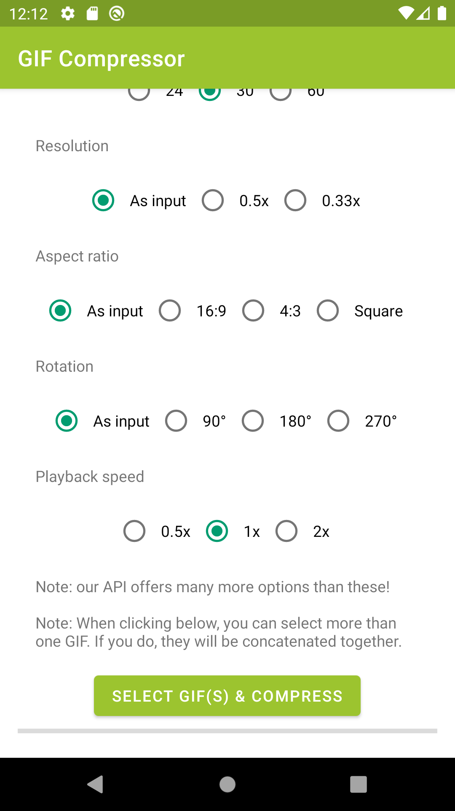

[](https://travis-ci.org/natario1/GIFCompressor)
[](https://github.com/natario1/GIFCompressor/releases)
[](https://github.com/natario1/GIFCompressor/issues)

&#10240;  <!-- Hack to add whitespace -->

<p align="center">
  
</p>

*Looking for a complete and powerful video transcoder? Take a look at our [Transcoder](https://github.com/natario1/Transcoder).*

*Need support, consulting, or have any other business-related question? Feel free to <a href="mailto:mat.iavarone@gmail.com">get in touch</a>.*

# GIFCompressor

Compresses GIF files into the MP4 format, using hardware accelerated Android codecs available on the device. Works on API 18+.

```groovy
implementation 'com.otaliastudios.gif:compressor:1.0.0'
```

- Fast compression to lightweight MP4 (AVC)
- Hardware accelerated
- Multithreaded
- Convenient, fluent API
- Concatenate multiple GIF files [[docs]](#gif-concatenation)
- Choose output size, with automatic cropping [[docs]](#frame-size)
- Choose output rotation [[docs]](#frame-rotation) 
- Choose output speed [[docs]](#video-speed)
- Choose output frame rate [[docs]](#other-options)
- Override frames timestamp, e.g. to slow down the middle part of the video [[docs]](#time-interpolation) 
- Error handling [[docs]](#listening-for-events)
- Configurable strategies [[docs]](#strategies)

&#10240;  <!-- Hack to add whitespace -->

<p align="center">
  
</p>

&#10240;  <!-- Hack to add whitespace -->

Using GIFCompressor in the most basic form is pretty simple:

```java
GIFCompressor.into(filePath)
        .addDataSource(context, uri) // or...
        .addDataSource(context, filePath) // or...
        .addDataSource(context, fileDescriptor) // or...
        .addDataSource(dataSource)
        .setListener(new GIFListener() {
             public void onGIFCompressionProgress(double progress) {}
             public void onGIFCompressionCompleted() {}
             public void onGIFCompressionCanceled() {}
             public void onGIFCompressionFailed(@NonNull Throwable exception) {}
        }).compress()
```

Take a look at the demo app for a real example or keep reading below for documentation.

## Setup

This library requires API level 18 (Android 4.3) or later.
If your app targets older versions, you can override the minSdkVersion by
adding this line to your manifest file:

```xml
<uses-sdk tools:overrideLibrary="com.otaliastudios.gif" />
```

In this case you should check at runtime that API level is at least 18, before
calling any method here.

## Data Sources

Starting a compression operation will require a source for our data, which is not necessarily
a `File`. The `DataSource` objects will automatically take care about releasing streams / resources,
which is convenient but it means that they can not be used twice.

#### `UriDataSource`

The Android friendly source can be created with `new UriDataSource(context, uri)` or simply
using `addDataSource(context, uri)` in the compression builder.

#### `FileDescriptorDataSource`

A data source backed by a file descriptor. Use `new FileDescriptorDataSource(context, descriptor)` or
simply `addDataSource(context, descriptor)` in the compression builder.

#### `FilePathDataSource`

A data source backed by a file absolute path. Use `new FilePathDataSource(context, path)` or
simply `addDataSource(context, path)` in the compression builder.

## GIF Concatenation

As you might have guessed, you can use `addDataSource(source)` multiple times. All the source
GIFs will be stitched together:

```java
Transcoder.into(filePath)
        .addDataSource(source1)
        .addDataSource(source2)
        .addDataSource(source3)
        // ...
```

In the above example, the three GIF files will be stitched together in the order they are added
to the builder. Once `source1` ends, we'll append `source2` and so on. The library will take care
of applying consistent parameters (frame rate, bit rate) during the conversion.

For Example:

```java
GIFCompressor.into(filePath)
        .addDataSource(source1) // 20 seconds
        .addDataSource(source2) // 5 seconds
        .addDataSource(source3) // 5 seconds
        // ...
```

In the above example, the output file will be 30 seconds long:

```kotlin
Video: | •••••••••••••••••• source1 •••••••••••••••••• | •••• source2 •••• | •••• source3 •••• |  
```

## Listening for events

GIF compression will happen on a background thread, but we will send updates through the `GIFListener`
interface, which can be applied when building the request:

```java
GIFCompressor.into(filePath)
        .setListenerHandler(handler)
        .setListener(new GIFListener() {
             public void onGIFCompressionProgress(double progress) {}
             public void onGIFCompressionCompleted() {}
             public void onGIFCompressionCanceled() {}
             public void onGIFCompressionFailed(@NonNull Throwable exception) {}
        })
        // ...
```

All of the listener callbacks are called:

- If present, on the handler specified by `setListenerHandler()`
- If it has a handler, on the thread that started the `compress()` call
- As a last resort, on the UI thread

#### `onGIFCompressionProgress`

This simply sends a double indicating the current progress. The value is typically between 0 and 1,
but can be a negative value to indicate that we are not able to compute progress (yet?).

This is the right place to update a ProgressBar, for example.

#### `onGIFCompressionCanceled`

The compression operation was canceled. This can happen when the `Future` returned by `compress()`
is cancelled by the user.

#### `onGIFCompressionFailed`

This can happen in a number of cases and is typically out of our control. Input options might be
wrong, write permissions might be missing, codec might be absent, input file might be not supported
or simply corrupted.

You can take a look at the `Throwable` being passed to know more about the exception.

#### `onGIFCompressionCompleted`

Compression operation succeeded. The output file now contains the desired video.

## Strategies

Track strategies return options for the engine to understand how the GIF file (or files)
should be compressed.

```java
Transcoder.into(filePath)
        .setStrategy(strategy)
        // ...
```

The point of `Strategy` is to inspect the input `android.media.MediaFormat` and return
the output `android.media.MediaFormat`, filled with required options.

This library offers a default strategy that covers most use cases, called `DefaultStrategy`.
This strategy converts the GIF stream to AVC format and is very configurable. 

### Frame Size

The `DefaultStrategy` helps in defining a consistent output size. If the chosen size does not 
match the aspect ratio of the input GIF(s) size, `GIFCompressor` will automatically crop part 
of the input so it matches the final ratio.

We provide helpers for common tasks:

```java
DefaultStrategy strategy;

// Sets an exact size. If aspect ratio does not match, cropping will take place.
strategy = DefaultStrategy.exact(1080, 720).build();

// Keeps the aspect ratio, but scales down the input size with the given fraction.
strategy = DefaultStrategy.fraction(0.5F).build();

// Ensures that each video size is at most the given value - scales down otherwise.
strategy = DefaultStrategy.atMost(1000).build();

// Ensures that minor and major dimension are at most the given values - scales down otherwise.
strategy = DefaultStrategy.atMost(500, 1000).build();
```

In fact, all of these will simply call `new DefaultStrategy.Builder(resizer)` with a special
resizer. We offer handy resizers:

|Name|Description|
|----|-----------|
|`ExactResizer`|Returns the exact dimensions passed to the constructor.|
|`AspectRatioResizer`|Crops the input size to match the given aspect ratio.|
|`FractionResizer`|Reduces the input size by the given fraction (0..1).|
|`AtMostResizer`|If needed, reduces the input size so that the "at most" constraints are matched. Aspect ratio is kept.|
|`PassThroughResizer`|Returns the input size unchanged.|

You can also group resizers through `MultiResizer`, which applies resizers in chain:

```java
// First scales down, then ensures size is at most 1000. Order matters!
Resizer resizer = new MultiResizer();
resizer.addResizer(new FractionResizer(0.5F));
resizer.addResizer(new AtMostResizer(1000));

// First makes it 16:9, then ensures size is at most 1000. Order matters!
Resizer resizer = new MultiResizer();
resizer.addResizer(new AspectRatioResizer(16F / 9F));
resizer.addResizer(new AtMostResizer(1000));
```

This option is already available through the `DefaultStrategy` builder, so you can do:

```java
DefaultStrategy strategy = new DefaultStrategy.Builder()
        .addResizer(new AspectRatioResizer(16F / 9F))
        .addResizer(new FractionResizer(0.5F))
        .addResizer(new AtMostResizer(1000))
        .build();
```

### Other options

You can configure the `DefaultStrategy` with other options unrelated to the video size:

```java
DefaultStrategy strategy = new DefaultStrategy.Builder()
        .bitRate(bitRate)
        .bitRate(DefaultVideoStrategy.BITRATE_UNKNOWN) // tries to estimate
        .frameRate(frameRate) // will be capped to the input frameRate
        .keyFrameInterval(interval) // interval between key-frames in seconds
        .build();
```

## Advanced Options

### Frame rotation

You can set the output rotation with the `setRotation(int)` method. This will apply a clockwise
rotation to the input GIF frames. Accepted values are `0`, `90`, `180`, `270`:

```java
GIFCompressor.into(filePath)
        .setRotation(rotation) // 0, 90, 180, 270
        // ...
```

### Time interpolation

We offer APIs to change the timestamp of each GIF frame. You can pass a `TimeInterpolator`
to the compressor builder to be able to receive the frame timestamp as input, and return a new one
as output.

```java
GIFCompressor.into(filePath)
        .setTimeInterpolator(timeInterpolator)
        // ...
```

As an example, this is the implementation of the default interpolator, called `DefaultTimeInterpolator`,
that will just return the input time unchanged:

```java
@Override
public long interpolate(long time) {
    // Receive input time in microseconds and return a possibly different one.
    return time;
}
```

It should be obvious that returning invalid times can make the process crash at any point, or at least
the compression operation fail.

### Video speed

We also offer a special time interpolator called `SpeedTimeInterpolator` that accepts a `float` parameter
and will modify the video speed.

- A speed factor equal to 1 will leave speed unchanged
- A speed factor < 1 will slow the GIF down
- A speed factor > 1 will accelerate the GIF

This interpolator can be set using `setTimeInterpolator(TimeInterpolator)`, or, as a shorthand, 
using `setSpeed(float)`:

```java
GIFCompressor.into(filePath)
        .setSpeed(0.5F) // 0.5x
        .setSpeed(1F) // Unchanged
        .setSpeed(2F) // Twice as fast
        // ...
```

## Compatibility

As stated pretty much everywhere, **not all codecs/devices/manufacturers support all sizes/options**.
This is a complex issue which has no easy solution - a wrong size can lead to a compression error 
or corrupted file.

Android platform specifies requirements for manufacturers through the [CTS (Compatibility test suite)](https://source.android.com/compatibility/cts).
Only a few codecs and sizes are **strictly** required to work.

We collect common presets in the `DefaultStrategies` class:

```java
GIFCompressor.into(filePath)
        .setStrategy(DefaultStrategies.for720x1280()) // 16:9
        .setStrategy(DefaultStrategies.for360x480()) // 4:3
        // ...
```

## License

This project is licensed under Apache 2.0.

```
Copyright (C) 2019 Mattia Iavarone

Licensed under the Apache License, Version 2.0 (the "License");
you may not use this file except in compliance with the License.
You may obtain a copy of the License at

    http://www.apache.org/licenses/LICENSE-2.0

Unless required by applicable law or agreed to in writing, software
distributed under the License is distributed on an "AS IS" BASIS,
WITHOUT WARRANTIES OR CONDITIONS OF ANY KIND, either express or implied.
See the License for the specific language governing permissions and
limitations under the License.
```
